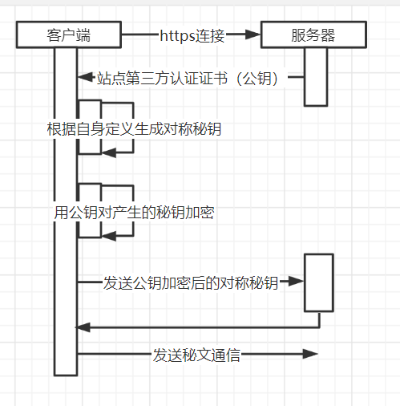

## 性能优化

### 一道小题题

#### 一、浏览器上输入 URL(资源定位符) 后，都发生了什么？

- #### http 和 TCP 的区别？

  http://baidu.com - http 协议

  1、http 是应用层协议 而 TCP 是传输层协议

  2、http 基于 TCP 实现连接，包括 http 的请求、发送、断开

  - ##### 优化点 1：
    根据业务选择使用 TCP 还是 UDP
    - TCP 天然的要比 UDP 慢一些，因为 TCP 连接需要确认连接的过程（三次拉手），也是因为这个，TCP 要比 UDP 的确认性更好，UDP 只注重消息发出去了，不在乎对方收不收。那如何保证安全性呢？通过 HTTPS。
  - ##### 优化点 2

    http1.0 http1.1 http2.0

    - http1.1 - 支持 keep-alive(属性) - 同一个应用或者同一个页面可以复用同一个 TCP 通道，保持 TCP 的连续畅通，不用重复的建立连接，只用做内容的传输。

    - HTTP2.0 - 多条并发请求，复用同一个 TCP 通路，无并发限制。
    - ##### 如何理解：
      - http1.0 中每次请求都要建立一次 TCP 连接，而 TCP 连接的开销是很大的。
        为了解决这个问题。
      - http1.1 引入了 keep-alive，可以在一个 TCP 连接上建立多个 http 请求，因为协议模型是在 http1.0 的基础上调整的。所以缺点也很明显，就是在通一个 TCP 连接上，多个 http 请求会发生阻塞，在 chrome 浏览器上，基于 http1.0 fetch10 个请求，你会发现只并发了 6 个，如果这 6 个中一个完成，则剩余 4 个请求中发送一个，形成瀑布流。
      - http2.0 就没有这个限制，因为 http 请求复用的是同一个 TCP 通路，所以没有请求请发的限制，就没有阻塞。

  3、http 无状态 TCP 有状态

- #### 什么是 HTTPS？

  https://baidu.com - https 协议

  - HTTP + SSL(TLS : 安全传输层的协议) ==> 用来保证传输过程中的安全性。位于传输层和应用层之间。

- ##### HTTPS 的原理是什么？
  - https 是非对称加密：服务端发送一个公钥，客户端自定义产生自己的私钥，再用公钥对私钥进行加密，发送至服务端。这样服务端就有了能够打开客户端发送信息的钥匙，不用担心发送的内容被抓包到，因为被抓到也没有客户端的私钥进行解密，任何的通信都有可能会被劫持，但是 https 保证了劫持后人家破解不了。

- ##### HTTPS 的多次连接
  - HTTPS 多次连接会导致网络延迟时间延长，因为相对于 HTTTP，HTTPS 多了一个加解密的过程，这个过程也是有时间消耗的。
  - 如何优化：合并请求、长链接。
    - 合并请求：两种方案
      - 前端通过 promise.all() / rece()等方法实现请求的并发
      - 通过中间层(胶水层一般指的就是中间层)：例如 node 中间层，去合并转发请求。中间层能做的事情有很多，例如后台返回的数据解决不符合前端的要求，可以通过中间层转化；或者说可以将多个后端接口包装成一个接口给前端使用，这里有一个常见问题
        - 如果多个接口有一个报错了，你会怎么处理？这里没有正确答案，但是得有一个思路。

file:///C:Users/class - 本地文件目录地址，只在本机打开
